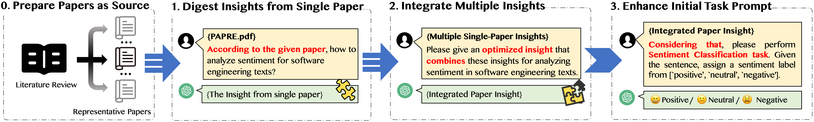

# SALON

In this paper, we propose a paper-insight-enhanced prompting approach, which “digest” and aggregate the specific domain knowledge of SA4SE from formally published papers in this field, such as fallible neutral technical terms and complicated sentence structures, then to analyze sentiments on SE texts through ChatGPT-like LLM tools with enhanced prompts. The schematic diagram of our prompting approach is as follows:

  

Specifically, besides our initial prompts that guide ChatGPT to analyze sentiments on SE texts, we **first** choose to use LLM’s another strong ability of summarizing long input texts to “digest” the “insights” from a series of typical SA4SE papers (stored in the "essays" package). We collected these papers from Lin et al.’s representative [survey](https://dl.acm.org/doi/10.1145/3490388) on SA4SE and its applications for software development. To focus on the insights of SA4SE itself, we only consider the surveyed papers that discuss how to propose, enhance, and evaluate SA4SE approaches, without involving those that utilize SA4SE for different software development tasks. We thus got 13 papers in total as the input of our approach, including 2 surveys (Lin et al.’s paper included), 7 proposed approaches, and 4 benchmark studies. These papers are involved with no further filtering rules because we want to make no bias in our paper-insights-digesting process, and keep the process of collecting paper insights of SA4SE as unsupervised as possible. We **then** propose two different prompts to digest each paper’s insights, i.e., the generic prompts that simply ask ChatGPT “how to analyze sentiment for 189 SE texts”, and the specialized prompts that ChatGPT “why and how to distinguish technical details and sentiment expressions when analyzing sentiments for SE texts” according to the main challenge discussed in SA4SE papers. We use both prompts as the two different configurations of our proposed approach to explore whether the paper digesting process can be further improved by the user’s expertise. **Second**, we propose another prompt for ChatGPT to aggregate all digested paper insights as an integrated enhancement, trying to cover all possible domain knowledge of SA4SE. **Finally**, we enhance the intial SA4SE prompt and perform the SA4SE tasks through ChatGPT and other LLM tools. We name our proposed approach as **SALON** (**S**entiment **A**nalysis with **L**LM-digested paper insights as pr**O**mpts for software engi**N**eering), and expect it to be a lightweight and easy-to-use SA4SE approach that requires no training but still effective on SE texts from different software projects across multiple collaboration platforms.

To evaluate our approach, we compare SALON with **four state-of-the-art SA4SE baselines** on **five different datasets of SE texts** that are extracted from four different collaboration platforms, i.e., Stack Overflow, Jira, GitHub, and app stores. The experiment results  show that SALON with specialized digesting prompts improves overall accuracy by an average of **6.73%** and Macro-F by **6.84%** compared to the intial SA4SE prompt without any insight enhancement, and can outperform all baselines with an improvement of **3.33%~13.96%** in overall accuracy and **5.85%~16.64%** in Macro-F.  These findings suggest  that aggregated LLM-digested research insights can effectively help LLMs “learn” the specific domain knowledge of SA4SE.

## The baseline approaches used in our paper can be found in:

- [SentiStrength-SE](https://laser.cs.uno.edu/Projects/Projects.html)
- [SESSION](https://github.com/huiAlex/SESSION)
- [Senti4SD](https://github.com/collab-uniba/Senti4SD)
- [EASTER](https://github.com/xiaobo-lab/EASTER)

## The dataset used in our paper can be found in:

- One Stack Overflow dataset from [the work of Calefato et al.](https://github.com/collab-uniba/Senti4SD)
- Three datasets from [the work of Lin et al.](https://sentiment-se.github.io/replication.zip)
- One GitHub dataset from [the work of Coutinho et al.](https://github.com/opus-research/sentiment-replication/)

If you need to use the aforementioned baseline approach or datasets, you are required to comply with their respective licenses issued at the time of publication and cite the original papers.

## Project structure：

│ ├── ChatGPT/

│ ├────── outputs/ # The results of different insight prompts in the experiment

│ ├────── gpt_completion.py # How to configure ChatGPT API

│ ├── essays/

│ ├── human_labeled/ # Test set and its manual annotation

│ ├── input/ # The pure texts of test set

│ ├── insights/

│ ├── questions/

│ ├── analysis_senti_for_file.py # Main program entry, used to set which prompt to complete the SA4SE tasks

│ ├── data analysis.xlsx # Detailed evaluation data for all experiments

│ ├── evaluate.py

│ ├── insight_extractor.py

│ ├── merge_insights.py # Merge insights from different essays

│ └── prompts.py

## How to run this project：

1. Fill in your api_key in the file gpt_complete.py
2. Set the prompt you want to use for SA4SE in the analysis_senti_for_file.py

